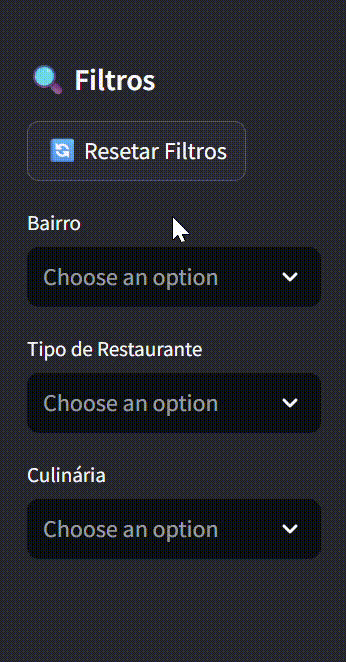

<h1>Sistema de Análise de Restaurantes</h1>

A principal proposta foi transformar dados de restaurantes do Zomato em uma aplicação interativa e analítica. O sistema oferece insights sobre distribuição geográfica, qualidade, preços e tendências culinárias através de visualizações dinâmicas e filtros personalizáveis. O projeto possui por finalidade praticar análise de dados e desenvolvimento de dashboards interativos.

<h2>Tecnologias utilizadas</h2>
<ul>
    <li><strong>Python v3.13.3</strong></li>
    <li><strong>SQLite v3.49.1</strong>: Gerencia banco de dados SQLite. Usado para armazenar e consultar dados dos restaurantes.</li>
    <li><strong>Pandas v2.2.3</strong>: Manipula dados em DataFrames. Usado para processar CSV e executar consultas SQL estruturadas.</li>
    <li><strong>Streamlit v1.45.1</strong>: Cria dashboards interativos com interface web. Usado para visualizações e filtros dinâmicos.</li>
    <li><strong>Plotly v5.17.0</strong>: Biblioteca de visualização interativa. Usado para gráficos, mapas e análises visuais.</li>
    <li><strong>SQLAlchemy v2.0.23</strong>: ORM para conexão com banco de dados. Facilita consultas e manipulação de dados.</li>
    <li><strong>Geopy v2.4.0</strong>: Geocodificação de endereços. Usado para obter coordenadas dos bairros para mapeamento.</li>
</ul>

<h2>Estrutura das pastas</h2>

<pre>
REST-ANALYTIC/
├── restaurantes.db              # Banco de dados SQLite
├── zomato.csv                   # Dataset dos restaurantes
├── banco.py                     # Script de criação e população do banco
│── streamlit.py                 # Aplicação principal do dashboard            
└── bairro_coords.json           # Coordenadas dos bairros para mapeamento

</pre>

Outros arquivos e pastas foram omitidos por não serem essenciais para o entendimento da estrutura do projeto.

<h2>Funcionalidades</h2>

<h3>📊 Visão Geral</h3>

<ul>
  <li>Métricas principais: total de restaurantes, nota média, total de votos e custo médio.</li>
  <li>Distribuição de avaliações através de histograma interativo.</li>
  <li>Análise ECDF da distribuição de custos dos restaurantes.</li>
  <li>Matriz custo x nota com barras empilhadas coloridas.</li>
  <li>Comparação entre restaurantes com e sem delivery.</li>
  <li>Classificação por faixas de preço (Econômico, Intermediário, Premium).</li>
</ul>

 

<h3>📍 Oferta e Mix</h3>

<ul>
  <li><strong>Densidade por Bairro</strong>: Visualiza distribuição de tipos de restaurantes por localização.</li>
  <li><strong>Mix de Culinárias</strong>: Top 50 nichos de cozinhas mais atendidos com gráfico horizontal.</li>
  <li><strong>Análise Geográfica</strong>: Identifica áreas com maior variedade e competitividade.</li>
  <li>Filtros dinâmicos por bairro, tipo de restaurante e culinária.</li>
</ul>

 

<h3>🌟 Qualidade</h3>

<ul>
  <li><strong>Top 20 Mais Votados</strong>: Restaurantes com maior engajamento e suas avaliações.</li>
  <li><strong>Correlação Qualidade x Popularidade</strong>: Análise da relação entre votos e notas.</li>
  <li>Identificação de restaurantes com alta reputação e reconhecimento.</li>
  <li>Insights sobre visibilidade versus qualidade percebida.</li>
</ul>

 

<h3>📈 Expansão</h3>

<ul>
  <li><strong>Análise por Faixa de Custo</strong>: Avaliação média por segmento de preço.</li>
  <li><strong>Oportunidades de Mercado</strong>: Identificação de nichos com potencial.</li>
  <li><strong>Distribuição de Saturação</strong>: Análise de concentração por faixa de preço.</li>
  <li>Recomendações estratégicas para novos investimentos.</li>
</ul>

 

<h3>🧠 Inteligência</h3>

<ul>
  <li><strong>Pratos Mais Apreciados</strong>: Análise dos pratos mais citados em gráfico de pizza.</li>
  <li><strong>Mapa Geográfico</strong>: Visualização das avaliações por bairro em mapa interativo.</li>
  <li><strong>Tendências Culinárias</strong>: Identificação de preferências regionais.</li>
  <li>Orientações para decisões de marketing e expansão.</li>
</ul>

 

<h3>Filtros Avançados</h3>

<ul>
  <li>Sidebar com filtros por bairro, tipo de restaurante e culinária.</li>
  <li>Botão para resetar todos os filtros aplicados.</li>
  <li>Atualização dinâmica de todas as visualizações conforme filtros.</li>
  <li>Persistência de estado durante a sessão.</li>
</ul>

<h2>Como rodar esse projeto em seu ambiente</h2>

<h3>Pré-requisitos:</h3>
<ul>
  <li>Python v3.13.3 ou superior</li>
  <li>Git instalado</li>
  <li>Navegador moderno (Chrome, Firefox, etc.)</li>
</ul>

<h3>Passo a passo:</h3>
<ol>

  <li>
    <strong>Instale o Git (caso não possuir)</strong> 
    Acesse: <a href="https://git-scm.com/downloads" target="_blank">git-scm.com/downloads</a> 
    Baixe e instale conforme seu sistema operacional. 
    Verifique a instalação com:
    <pre><code>git --version</code></pre>
  </li>

  <li>
    <strong>Clone o repositório do projeto</strong>
    <pre><code>git clone https://github.com/emylygaby/rest-analytic</code></pre>
  </li>

  <li>
    <strong>Instale as dependências do projeto</strong> 
    <pre><code>pip install streamlit pandas plotly sqlalchemy geopy</code></pre>
  </li>

  <li>
    <strong>Inicialize o banco de dados</strong>
    <pre><code>python banco.py</code></pre>
  </li>

  <li>
    <strong>Execute a aplicação com Streamlit</strong>
    <pre><code>streamlit run streamlit.py</code></pre>
  </li>

  <li>
    <strong>Acesse no navegador</strong> 
    Streamlit abrirá automaticamente. Caso contrário, acesse:
    <pre><code>http://localhost:8501</code></pre>
  </li>

</ol>

<h2>⚠️ Importante</h2>

Todos os dados utilizados neste projeto são provenientes de datasets públicos do Zomato e são utilizados exclusivamente para fins educacionais e de demonstração. O projeto não coleta, armazena ou processa informações pessoais ou sensíveis de usuários. As análises apresentadas são baseadas em dados históricos e podem não refletir a situação atual dos estabelecimentos mencionados.

<h2>Contribuições</h2>

Este projeto está aberto para contribuições via issues. Se você encontrou um bug, deseja sugerir uma melhoria ou tem dúvidas sobre o funcionamento, siga as instruções abaixo:

<ol>
    <li>Verifique se já existe uma issue sobre o assunto. Caso sim, adicione um comentário nela.</li>
    <li>Se não houver, abra uma nova issue com uma descrição clara e objetiva.</li>
</ol>

<h2>Licença e Autor</h2>

Este projeto foi desenvolvido para fins educacionais e está licenciado sob a licença MIT. Veja o <a href="./LICENSE">documento</a> para mais detalhes.

